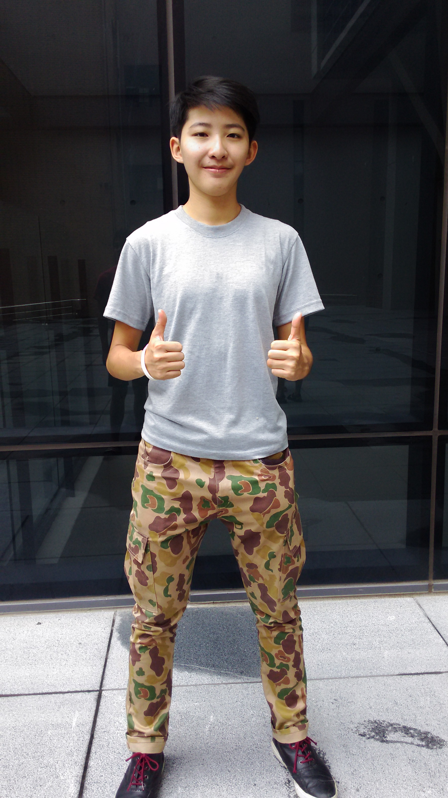

家鄉：台南（我絕不會說東西都超好吃的！）

曾任：
 - 101學年度醫學系系會文宣長
 - 101學年度南友會會長
 - 102學年度學生會宣傳部長
 - 103學年度學生會宣傳部長

星座：巨蟹

嗜好：平時喜歡假掰唱歌+打球(系女籃歡迎你)跑步，偶爾做些平面設計怡怡情，放假就是看閒書的好時光，一有空閒時間就會想發露社會議題時事！

對系會的期許：
Giving is the best communication.
系學會在這一年想營造出一個家的氛圍，從各個面向去服務同學，讓大家在課業之外也能有不同的課外學習資源與各種陶養身心的交流活動。

今年度系學會行政部門的大型活動如下：
 - 活動部：《上》吃東西大賽、耶誕舞會《下》醫學之夜、醫學週、K歌之夜
 - 公關部：《上》《下》特約商店簽立
 - 學術部：《上》BLOCK講座、國考講座、職涯講座《下》職涯講座
 - 權益部：《上》《下》常設問卷管道、議題講座、系主任有約《上》學權週
 - 體育部：《上》兄弟姊妹盃《下》大醫盃

在一連串的講座與活動中我們希望串連起系上的感情，而由FB總版的建立去加強系會與同學間的連結及各年級之間縱向的交流等。

本年度「學生權益」也是我們的核心政見，藉由權益部常設的網路反應管道，在收到同學的申訴或建議案後能在平常就進行介入了解與處理。在與校方達成共識後將會公布「問題反應表單網址」及系會權益部學生問題反應處理的SOP。

最後，如果有任何的困難都可以洽詢系會，這裡也預祝不管是在哪個階段的學弟妹、同學、學長姐，在這新的一年能獲得更多，步步邁向自己的目標。一些需要注意、改進的地方再請大家多多指教了！
